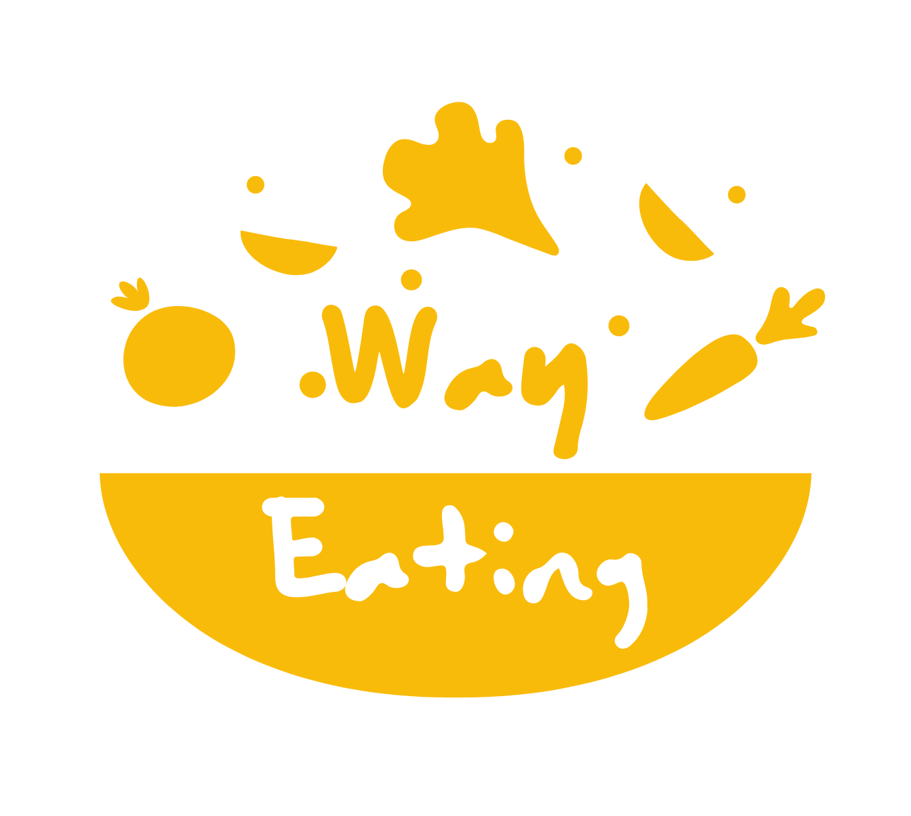
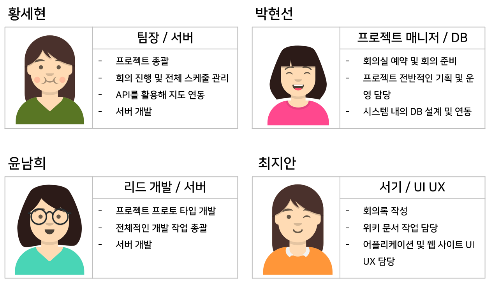
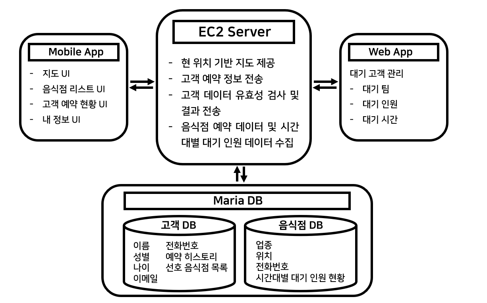
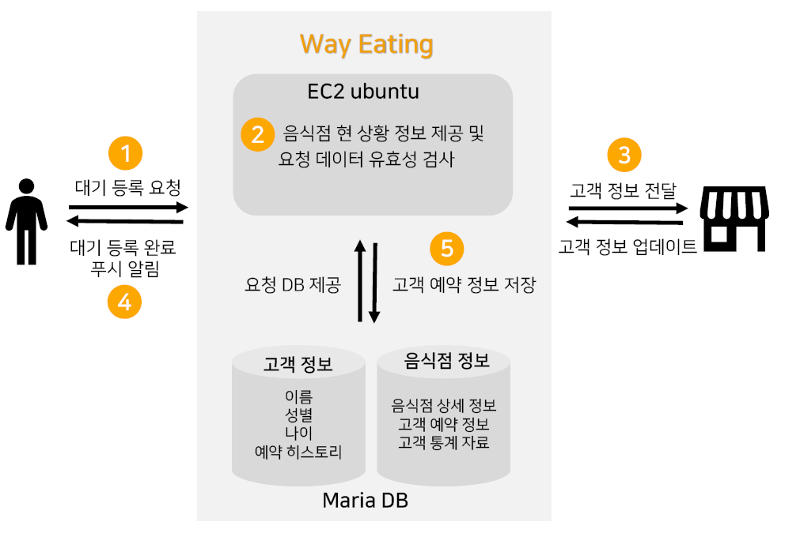
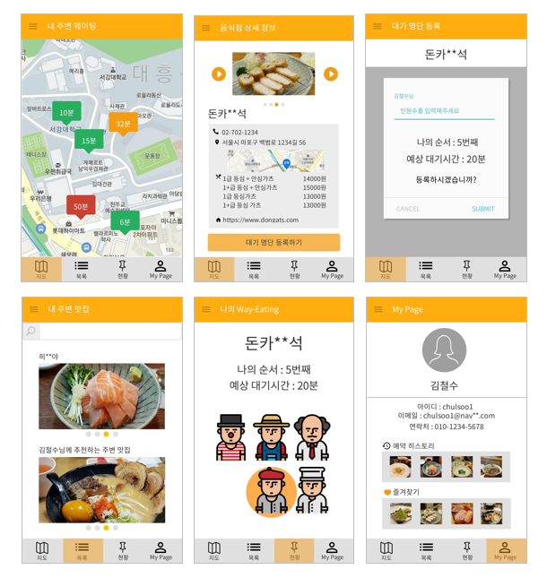
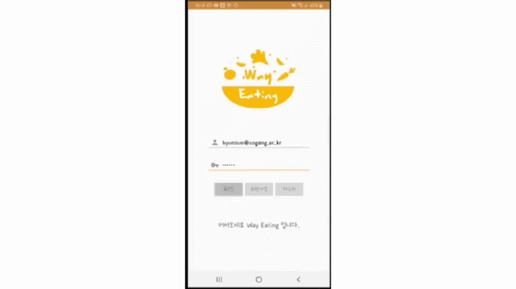
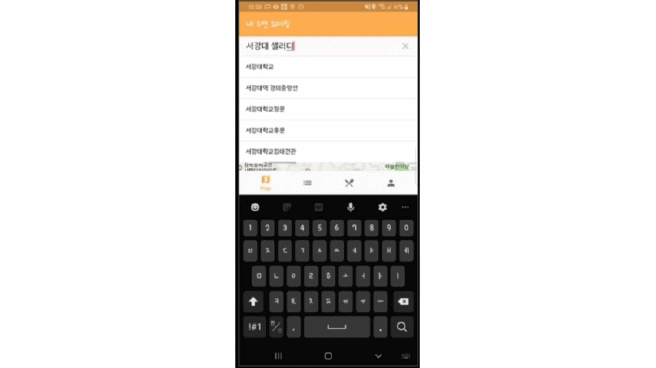
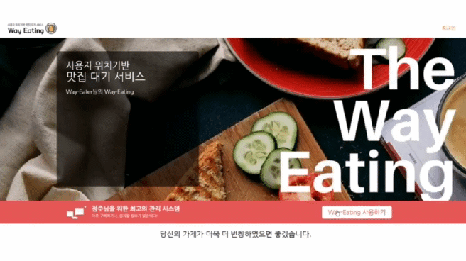

# Way-Eating 🍔
</img>

음식점 대기 현황 확인 및 예약 어플리케이션

웨이팅없이 밥 먹으러 가는 즐거운 길이라는 뜻의 **Way-Eating** 입니다.

---

### 목차 📝
1. [프로젝트 추진 배경](#프로젝트-추진-배경)
2. [팀원 소개](#팀원-소개)
3. [시스템 아키텍쳐](#시스템-아키텍쳐)
4. [서비스 시나리오](#서비스-시나리오)
5. [최종 결과물](#최종-결과물)
6. [Reference](#Reference)

---

### 프로젝트 추진 배경
> 친구들과 서울의 XX동에서 약속을 잡으면 대부분의 사람들은 가장 먼저 'XX동 맛집’을 검색해보게 됩니다. 인터넷 포털 및 소셜 네트워크 서비스 상에서 유명 맛집 정보는 하루에도 수만건씩 공유되고있고, 이에 따라 맛집을 방문하려는 사람들도 늘어나고 있습니다. 실제로 금요일 혹은 주말 저녁에 SNS 유명 맛집을 방문하면 최소 1시간 이상 대기해야하는 상황을 심심치 않게 접할 수 있습니. 사람들의 맛집 방문 빈도는 점점 증가하는 추세이지만, 수기 관리가 보편화 되어있는 현재 대부분의 맛집 대기 시스템은 많은 고객을 감당하기에 효율적이지 않습니다.
>  
> 이러한 문제점을 해결하기 위해 저희는 **맛집 대기 현황 확인 및 예약 서비스** 를 구상하였습니다. 해당 서비스를 통하여 맛집 방문객들은 온라인 상에서 대기 인원 현황을 한눈에 확인할 수 있을 뿐만 아니라 원격으로 대기 예약 또한 가능하여 대기 하는 동안의 시간을 보다 효율적으로 관리할 수 있게 됩니다.
 

### 팀원 소개
</img>
 

### 시스템 아키텍쳐
</img>
 

### 서비스 시나리오
</img>
 

### 최종 결과물
</img>

</img>

</img>

</img>

 

### Reference

- [논문 링크](http://www.dbpia.co.kr/journal/articleDetail?nodeId=NODE09301907)
- [Demo full video link ](https://youtu.be/6TpMvLVyujU)

